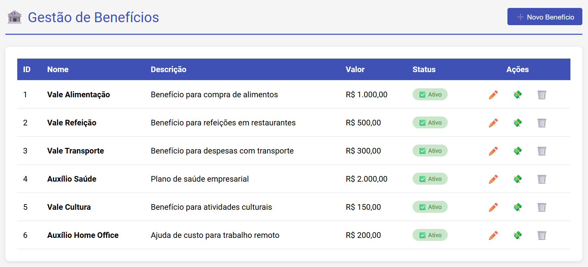

# 🏦 Sistema de Gestão de Benefícios

Sistema completo de gerenciamento de benefícios com **frontend Angular** e **backend Spring Boot + EJB**, implementando transferências seguras entre contas com correção de bug de concorrência (Lost Update Problem) através de **Optimistic Locking**.

## 📋 Índice

- [Sobre o Projeto](#sobre-o-projeto)
- [Arquitetura](#arquitetura)
- [Pré-requisitos](#pré-requisitos)
- [Instalação e Execução](#instalação-e-execução)
- [Endpoints da API](#endpoints-da-api)
- [Frontend Angular](#frontend-angular)
- [Docker](#docker)

---

## 🎯 Sobre o Projeto

Este projeto é uma solução para o desafio técnico de correção de bug de concorrência em transferências financeiras. O sistema permite:

- ✅ **Frontend Angular moderno** com Material Design e Toastr
- ✅ CRUD completo de benefícios
- ✅ Transferências seguras entre benefícios
- ✅ Prevenção de **Lost Update Problem** via Optimistic Locking
- ✅ Idempotência em transferências
- ✅ Integração Spring Boot + EJB
- ✅ Retry automático em conflitos de concorrência
- ✅ **Dockerização** (Frontend + PostgreSQL)


---

## 🏗️ Arquitetura

### Visão Geral
```
┌─────────────────────┐         ┌──────────────────────┐
│   Frontend Angular  │         │   PostgreSQL         │
│   (Nginx + Docker)  │         │   (Banco de Dados)   │
└──────────┬──────────┘         └──────────┬───────────┘
           │                               │
           │ HTTP/REST                     │ JDBC
           ↓                               ↓
┌─────────────────────────────────────────────────────┐
│              BACKEND-MODULE (Spring Boot)           │
│                                                     │
│  ┌─────────────┐    ┌──────────────┐              │
│  │ Controller  │───→│   Service    │              │
│  └─────────────┘    └──────┬───────┘              │
│                            │                        │
│                            ↓                        │
│                    ┌──────────────┐                │
│                    │ EJB Client   │                │
│                    └──────┬───────┘                │
│                            │                        │
└────────────────────────────┼────────────────────────┘
                             │
                             ↓
┌─────────────────────────────────────────────────────┐
│              EJB-MODULE (Sistema Legado)            │
│                                                     │
│  ┌──────────────────────┐                          │
│  │ BeneficioEjbService  │                          │
│  │  - transfer()        │ ← Lógica crítica         │
│  │  - Optimistic Lock   │   de negócio             │
│  │  - Validações        │                          │
│  └──────────────────────┘                          │
└─────────────────────────────────────────────────────┘
```

### Módulos

#### **1. frontend-angular** (Interface Web)
- **Responsabilidade:** Interface de usuário, formulários, validações client-side
- **Tecnologia:** Angular 19, Material Design, Nginx
- **Funcionalidades:** CRUD de benefícios, transferências, notificações em tempo real

#### **2. backend-module** (API REST)
- **Responsabilidade:** API REST, integração com EJB, idempotência
- **Tecnologia:** Spring Boot 3.2.5, Spring Data JPA, PostgreSQL
- **Status:** Sistema novo consumindo o legado

#### **3. ejb-module** (Sistema Legado)
- **Responsabilidade:** Lógica de negócio crítica de transferências
- **Tecnologia:** Jakarta EE (EJB 3.2), JPA

---

## ⚙️ Pré-requisitos

Certifique-se de ter instalado:

- ✅ **Java 17** ou superior ([Download](https://adoptium.net/))
- ✅ **Maven 3.8+** ([Download](https://maven.apache.org/download.cgi))
- ✅ **Node.js 18+** e **npm** ([Download](https://nodejs.org/))
- ✅ **Docker** e **Docker Compose** ([Download](https://www.docker.com/products/docker-desktop))
- ✅ **Git** ([Download](https://git-scm.com/downloads))
- ✅ **IntelliJ IDEA** (opcional, mas recomendado)

---

## 🚀 Instalação e Execução

### 📦 Opção 1: Execução com Docker (RECOMENDADO)

#### **1️⃣ Clonar o Repositório**
```bash
git clone https://github.com/seu-usuario/bip-teste-integrado.git
cd bip-teste-integrado
```

#### **2️⃣ Subir Todos os Serviços com Docker Compose**
```bash
cd docker
docker-compose up -d
```

Isso vai subir:
- ✅ PostgreSQL (porta 5432)
- ✅ Frontend Angular com Nginx (porta 8081)

#### **3️⃣ Rodar Backend Localmente** (Spring Boot)

1. Abra o projeto
2. Localize: `backend-module/src/main/java/com/example/backend/BackendApplication.java`
3. Clique com botão direito → **Run 'BackendApplication'**

#### **4️⃣ Acessar a Aplicação**
```
Frontend:  http://localhost:8081
Backend:   http://localhost:8080
Swagger:   http://localhost:8080/swagger-ui/index.html
```

---

## 📡 Endpoints da API

### Base URL
```
http://localhost:8080/api/v1
```

### Exemplos de Requisições

**Criar Benefício:**
```json
POST /api/v1/beneficios
{
  "nome": "Vale Refeição",
  "descricao": "Benefício para refeições",
  "valor": 500.00,
  "ativo": true
}
```

**Transferir Valor:**
```json
POST /api/v1/beneficios/transfer
{
  "fromId": 1,
  "toId": 2,
  "amount": 100.00,
  "idempotencyKey": "550e8400-e29b-41d4-a716-446655440001"
}
```

---

## 🎨 Frontend Angular

### Scripts Disponíveis
```bash
# Desenvolvimento
npm start              # Inicia servidor dev (http://localhost:4200)

# Build
npm run build          # Build de produção (dist/)

# Testes
npm test               # Executa testes unitários
```

### Funcionalidades do Frontend

- ✅ **Lista de Benefícios** - Tabela com todos os benefícios cadastrados
- ✅ **Criar/Editar Benefício** - Formulário com validações em tempo real
- ✅ **Transferir Valor** - Dialog modal para transferências
- ✅ **Excluir Benefício** - Com confirmação
- ✅ **Notificações Toast** - Feedback visual de todas as ações
- ✅ **Tratamento de Erros** - Interceptor global para erros HTTP

---

## 🐳 Docker

### Arquitetura de Containers
```
┌─────────────────────────────────────────────┐
│  docker-compose.yml                         │
├─────────────────────────────────────────────┤
│                                             │
│  ┌─────────────┐  ┌──────────────────────┐ │
│  │ PostgreSQL  │  │  Frontend (Nginx)    │ │
│  │   :5432     │  │      :8081           │ │
│  └─────────────┘  └──────────────────────┘ │
│        ↑                    ↑               │
│        │                    │               │
│        └────────────────────┘               │
│           beneficios-network                │
└─────────────────────────────────────────────┘
```

### Comandos Docker
```bash
# Subir todos os serviços
docker-compose up -d

# Ver logs
docker-compose logs -f

# Ver status
docker-compose ps

# Parar serviços
docker-compose down

# Rebuild de uma imagem específica
docker-compose build frontend

# Remover volumes (CUIDADO: apaga dados do banco)
docker-compose down -v
```
---

## 📊 Monitoramento

### Actuator Endpoints (Backend)
```bash
# Health check
curl http://localhost:8080/actuator/health

# Métricas
curl http://localhost:8080/actuator/metrics

# Info da aplicação
curl http://localhost:8080/actuator/info
```

### Health Check (Frontend)
```bash
# Verificar se Nginx está respondendo
curl http://localhost:8081
```

---

## 🧪 Testes

### Backend
```bash
cd backend-module

# Rodar todos os testes
mvn test

# Com relatório de cobertura (Jacoco)
mvn clean test jacoco:report
open target/site/jacoco/index.html
```

### Frontend
```bash
cd frontend-angular

# Testes unitários
npm test

# Build de produção (valida TypeScript)
npm run build
```

---

## 🔐 Segurança

### Backend
- ✅ CORS configurado para aceitar apenas origins permitidas
- ✅ Optimistic Locking para prevenir Lost Updates
- ✅ Validações de entrada com Bean Validation
- ✅ Transações gerenciadas pelo Spring

### Frontend
- ✅ Security headers no Nginx (X-Frame-Options, X-XSS-Protection)
- ✅ Validações client-side nos formulários
- ✅ Interceptor HTTP para tratamento de erros
- ✅ Sanitização de inputs do usuário

---

## 📚 Referências

- [Angular Documentation](https://angular.dev/)
- [Angular Material](https://material.angular.io/)
- [Spring Boot Documentation](https://spring.io/projects/spring-boot)
- [Jakarta EE Specification](https://jakarta.ee/)
- [JPA Optimistic Locking](https://docs.oracle.com/javaee/7/tutorial/persistence-locking.htm)
- [Docker Documentation](https://docs.docker.com/)
- [Nginx Documentation](https://nginx.org/en/docs/)

---
